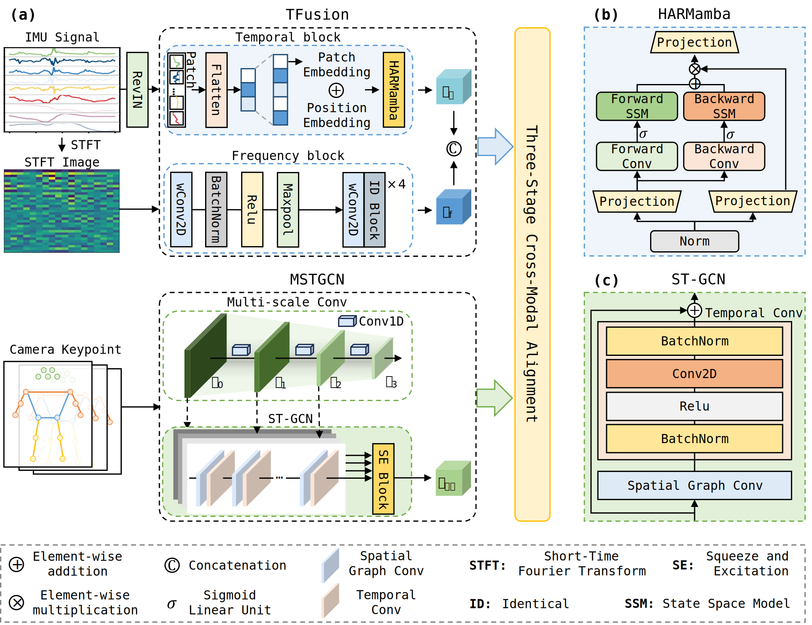
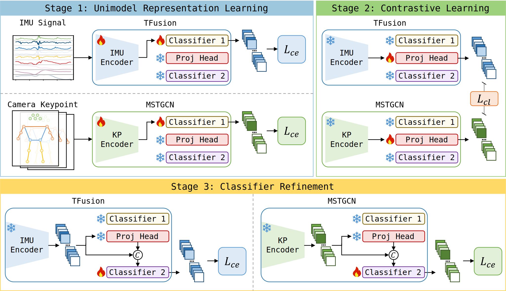

# CIKP: A Contrastive IMU-Keypoint Pretraining Framework for Unsafe Behavior Recognition of Scaffolding Workers
<p align="center"></p>

## Three-stage cross-modal alignment training strategy
<p align="center"></p>

- Stage 1: Supervised Representation Learning
- Stage 2: Contrastive Learning
- Stage 3: Classifier Refinement

## Environment
- python == 3.9
- pytorch == 2.2.0
- mamba-ssm == 2.2.6.post3
- scikit-learn == 1.3.0
- pandas == 2.2.2
- numpy == 1.26.4

## Usage
The detailed descriptions about the folders are as following:

| Folder name | Description|
| --- | --- |
| imunet | The source code of TFusion |
| kpnet | The source code of MSTGCN |
| data | The processed datasets |
| figure | The architecture of CIKP |
| checkpoint | The save model weights after training |

To evaluate CIKP on a dataset, run the corresponding test.ipynb in the code folder:

```Evaluate (SWIT dataset)
python test.ipynb
```

## Dataset
- SWIT dataset: https://doi.org/10.1016/j.aei.2025.103232
- Construction worker activity recognition dataset: https://doi.org/10.1016/j.autcon.2025.106032